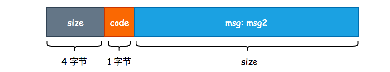
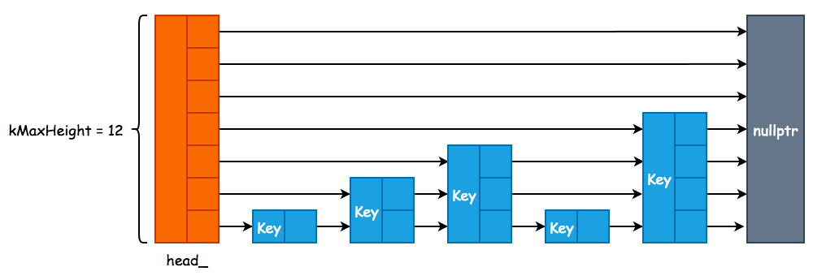

# leveldb 中常用的数据结构

## 1. Slice

Slice 是 leveldb 中使用最为频繁的数据结构，不管是 Write Batch，还是构建 SSTable，都需要 Slice 的重度参与。这里的 Slice 并不是 Go 语言中的切片，而是封装的 string 类型。

C++ 中的 `std::string` 只提供了简单的 `push_back`、`pop_back` 等方法，诸如 `starts_with`、`remove_prefix` 等方法都没有提供。因此，leveldb 使用 `char *` 自行封装了 string 对象，以满足功能需要。

Slice 中的成员变量只有两个，一个是 `char` 类型的字符指针，另一个则是字符串的长度。此外，Slice 本身并不负责内存分配，只是简单地接收外部传入的指针对象。

```cpp
class LEVELDB_EXPORT Slice {
public:
    /* 从 std::string 中构建 Slice 对象，s.data() 返回 string 首地址指针 */
    Slice(const std::string& s) : data_(s.data()), size_(s.size()) {}
    
    /* 主要用于从字面量中构建 Slice，例如 Slice("leveldb") */
    Slice(const char* s) : data_(s), size_(strlen(s)) {}
    
    /* 移除 Slice 的前 n 个字符，只是进行简单的指针运算 */
    void remove_prefix(size_t n) {
        data_ += n;
        size_ -= n;
    }
    
    /* 将 Slice 转化为 string 对象 */
    std::string ToString() const { return std::string(data_, size_); }
    
    /* 判断 Slice 是否以 Slice.data_ 为前缀 */
    bool starts_with(const Slice& x) const {
        return ((size_ >= x.size_) && (memcmp(data_, x.data_, x.size_) == 0));
    }
private:
    const char* data_;      /* 字符指针，保存字符串起始地址 */
    size_t size_;           /* 字符串长度，不包括 '\0' 结尾标志 */
};
```

Slice 的实现并不复杂，甚至没有提供内存分配机制，只是简单地进行了一个封装，但却是 leveldb 中最为重要的数据结构。

## 2. Status

在 Web 开发中，由于 HTTP 状态码数量有限，不能够完全地表达出调用 API 的结果，因此通常都会采用自定义 `error_code` 的方式实现，比如微信公众号的全局错误返回码: [全局返回码说明](https://developers.weixin.qq.com/doc/offiaccount/Getting_Started/Global_Return_Code.html)，一个统一的返回状态能够有效地降低后期运维成本。leveldb 并没有使用 Linux Kernel 的错误返回，而是使用 `Status` 类来制定统一的返回状态。

```cpp
class LEVELDB_EXPORT Status {
private:
    enum Code {
        kOk = 0,
        kNotFound = 1,
        kCorruption = 2,
        kNotSupported = 3,
        kInvalidArgument = 4,
        kIOError = 5
  };
  
  /* state_ 是分配在堆上的，使用 new char[] 的方式进行分配 */
  const char* state_;
};
```

leveldb 一共定义了 6 种状态，内部使用枚举类实现，每一个返回状态都会有对应的 2 个方法，一个是构造返回状态，另一个则是判断状态。以 `kNotFound` 为例:

```cpp
/* 通过 msg 构造 NotFound Status，其中 msg2 主要用于存储系统调用时的错误码，也就是 errno */
static Status NotFound(const Slice& msg, const Slice& msg2 = Slice()) {
    return Status(kNotFound, msg, msg2);
}

/* 判断当前 status 对象的状态是否为 NotFound */
bool IsNotFound() const { return code() == kNotFound; }
```

可以看到，方法名和状态名称之间是强耦合的，也就是说我们无法在不改变 `Status` 定义的前提下对其进行拓展，算是一个小小的缺点。

简单地看一下 Status 的构造函数实现，通过状态码和错误信息构造 Status 属于私有方法，只能由 `NotFound()`、`Corruption()`、`InvalidArgument()` 等方法调用，这又限制了我们自行拓展 Status 的能力。

```cpp
/* msg2 通常用于保存 errno */
Status::Status(Code code, const Slice& msg, const Slice& msg2) {

    /* 获取 msg 以及 msg2 的长度 */
    const uint32_t len1 = static_cast<uint32_t>(msg.size());
    const uint32_t len2 = static_cast<uint32_t>(msg2.size());
    
    /* 如果 len2 不为 0 的话，需要对 msg 和 msg2 做分割，leveldb
     * 使用 ": " 这两个字符进行分隔，属于硬编码 */
    const uint32_t size = len1 + (len2 ? (2 + len2) : 0);
    
    /* 5 就是 4 字节的 message 长度 + 1 字节的状态码 */
    char* result = new char[size + 5];
    
    /* 将 message 长度写入 */
    std::memcpy(result, &size, sizeof(size));
    /* 将状态码写入 */
    result[4] = static_cast<char>(code);
    std::memcpy(result + 5, msg.data(), len1);
    
    /* 使用 ": " 作为 msg 和 msg2 的分割线 */
    if (len2) {
        result[5 + len1] = ':';
        result[6 + len1] = ' ';
        std::memcpy(result + 7 + len1, msg2.data(), len2);
    }
    state_ = result;
}
```

Status 的结构如下图所示，在内部只需要使用 `state_[4]` 即可获得 Status 的具体状态:




## 3. Skip List

Memory Table 由 Skip List 实现，由于 leveldb 在对 Key 进行修改和删除操作时，采用的是追加方式，因此 Skip List 只需要实现插入和查找两个方法即可:

```cpp
template <typename Key, class Comparator>
class SkipList {
private:
    struct Node;
public:
    explicit SkipList(Comparator cmp, Arena* arena);
    
    void Insert(const Key& key);
    
    bool Contains(const Key& key) const;
private:
    enum { kMaxHeight = 12 };   /* 最大层高 */
    Arena* const arena_;        /* 内存分配器 */
    Node* const head_;          /* 虚拟头节点 */
};
```

Skip List 的核心结构为 `Node`，其内部采用原子变量来进行指针的相关操作，因此，leveldb 中的 Skip List 是线程安全的，并且使用的是无锁实现:

```cpp
template <typename Key, class Comparator>
struct SkipList<Key, Comparator>::Node {
    explicit Node(const Key& k) : key(k) {}
    Key const key;
    
    /* 原子性地获取当前 Node 的第 n 层的下一个节点指针 */
    Node* Next(int n) {
        /* std::memory_order_acquire 表示在 load() 之后的所有读写操作，
         * 不允许被重排到这个 load() 的前面 */
        return next_[n].load(std::memory_order_acquire);
    }
    
    /* 原子性地设置当前 Node 的第 n 层的下一个节点指针 */
    void SetNext(int n, Node* x) {
        /* std::memory_order_release 表示在 store() 之前的所有读写操作，
         * 不允许被重排到这个 store() 的后面 */
        next_[n].store(x, std::memory_order_release);
    }
private:
    std::atomic<Node*> next_[1];
};
```

Skip List 的大致结构如下，和 Redis 中跳跃表不同的是，leveldb 并没有使用 `prev` 指针，因为根本就用不到:



## 4. LRUCache

为了优化查询效率，leveldb 自行实现了一个标准的 LRU Cache，即哈希表+双向链表，并且 leveldb 选择了自行实现哈希表，并没有使用 `std::unordered_map`，同时使用了 `port::Mutex` 来保证 LRU Cache 的并发安全性。`port::Mutex` 其实就是对 `std::mutex` 的简单封装。