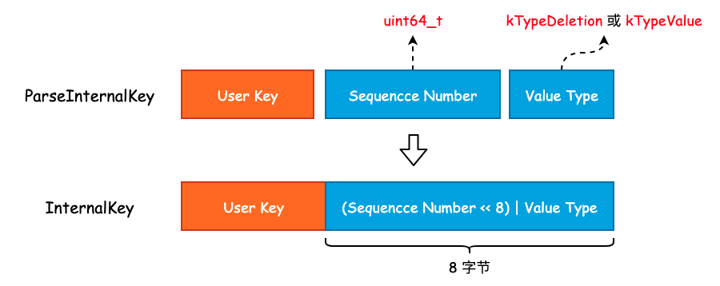
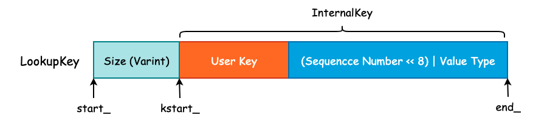
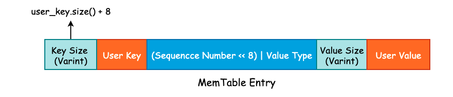

## leveldb 中的 varint 与 Key 组成

在 leveldb 中，int32 或者是 int64 采用的是变长存储，这一空间优化在 gRPC 中也有使用。其原理就是将原本需要使用 4 字节存储的 int32 或者是 8 字节存储的 int64 根据整数的实际大小使用不同的字节数进行存储。

比如说现在我们有一个 int32，其值为 1024，那么完全可以使用一个 int16 进行存储。但是因为我们需要考虑到存储值的上限，所以必须使用 int32 来实现。变长整数就是为了解决无论多大的数字都需要使用 4 字节 或者 8 字节 进行存储的问题的。

varint 是一种使用一个或多个字节序列化整数的方法，会把整数编码为变长字节。对于 32 位整型经过 varint 编码后需要 `1~5` 个字节，小的数字使用 1 字节，大的数字使用 5 字节。而 64 位整数根据 varint 编码后需要 `1~10` 个字节。在实际业务场景中，小整数的使用频率要远超于大整数的使用频率，因此使用 varint 编码能够有效的节省内存和硬盘的存储空间。


### 1. varint 编码

首先，leveldb 对整数提供了两种类型的编码，一种是 fixedint，另一种则是 varint。其中 fixedint 就是将 `uint32_t` 或者是 `uint64_t` 转换成 `char *`，而 varint 则是对整型进行变长编码，并写入到 `char *dst` 中。关于编码的实现全部都在 `util/coding.cc` 文件中。

#### 1.1 fixedint 编码

```cpp
inline void EncodeFixed32(char* dst, uint32_t value) {
    uint8_t* const buffer = reinterpret_cast<uint8_t*>(dst);
    buffer[0] = static_cast<uint8_t>(value);
    buffer[1] = static_cast<uint8_t>(value >> 8);
    buffer[2] = static_cast<uint8_t>(value >> 16);
    buffer[3] = static_cast<uint8_t>(value >> 24);
}
```

`EncodeFixed32()` 的实现非常简单，就是将 `value` 的每一个字节写入到 `dst` 中。并且可以看到，`value` 的低字节被写入到了 `buffer` 的低地址中。因此，数据存放的方式是按照先低位后高位的顺序存放的，也就是说，leveldb 采用的是小端存储（Little-Endian）。

#### 1.2 varint 编码

对于 varint 编码而言，每一个字节的最高位为保留位，1 表示后面仍有数据，0 则表示当前字节是 varint 的结尾。也就是说，varint 的每一个字节只能使用 7 位，所以当我们有一个 64 位长度的整型需要进行 varint 编码时，必须使用 10 个字节才能表示。这比原来的 8 字节还要多出 2 个字节，所以，varint 并不适合用于大整数占比非常多的情况。

```cpp
char* EncodeVarint64(char* dst, uint64_t v) {
    /* 每一个字节有效位为 7，最大只能表示 2^7 - 1 = 127 */
    static const int B = 128;
    uint8_t* ptr = reinterpret_cast<uint8_t*>(dst);
    
    /* 当 v 大于 127 时，说明还需要一个字节来保存 */
    while (v >= B) {
        *(ptr++) = v | B;
        v >>= 7;
    }
    *(ptr++) = static_cast<uint8_t>(v);
    return reinterpret_cast<char*>(ptr);
}
```

对于 `EncodeVarint64()` 我们唯一需要注意的是，传入的 `dst` 指针地址与函数返回 `result` 指针的地址必然不是同一个地址，`result` 指针相对于 `dst` 指针将会有 1~10 字节的偏移量，具体取决于 varint 到底使用了多少个字节。

```cpp
int main() {
    char *dst = new char[10];
    printf("before encode: %p \n", dst);

    uint32_t v = 128;
    dst = EncodeVarint64(dst, v);
    printf("after encode:  %p \n", dst);
}
```

运行上述程序得到的结果为:

```bash
before encode: 0x7fd6c1405880 
after encode:  0x7fd6c1405882
```

说明 128 在使用 varint 时必须使用 2 字节存储，同时也说明了原来 `dst` 指针发生了改变。


### 2. leveldb 中的 Key Format

由于 leveldb 是一个 K-V 存储引擎，并且使用 LSM 这一追加写的数据结构作为底层存储，那么对于 Key 的设计就变得至关重要了。

**一方面 Key 需要保存用户所存入的 User Key 信息，另一方面还必须存在一个序号来表示同一个 User Key 的多个版本更新**。

InnoDB 存储引擎为了实现 MVCC 则是将一个全局递增的 Transaciton ID 写入到 B+Tree 聚簇索引的行记录中。而 leveldb 则是使用一个全局递增的序列号（Sequence Number）写入到 Key 中，以实现 Snapshot 功能，本质上就是 MVCC。

**从另一个角度来说，如果某个 DB 支持 MVCC 或者说快照读功能的话，那么在其内部一定存在一个全局递增的序号，并且该序号是必须和用户数据一起被持久化至硬盘中的**。

最后，当我们使用 `Delete()` 删除一个 Key 时，实际上并不会找到这条数据并物理删除，而是追加写一条带有删除标志位的 Key。所以我们还需要一个标志位，来表示当前 Key 是否被删除，leveldb 中使用 `ValueType` 这个枚举类实现。

实际上，User Key、Sequence Number 以及 Value Type 正是组成一个 Key 的必要组件，并且在这些组件之上还会有一些额外的扩展，这些扩展也只是简单地使用 Varint 来记录 User Key 的长度而已。

#### 2.1 `InternalKey` 与 `ParsedInternalKey`

`InternalKey` 本质上就是一个字符串，由 User Key、Sequence Number 以及 Value Type 组成，是一个组合结构。而 `ParsedInternalKey` 其实就是对 `InternalKey` 的解析，将 User Key、Sequence Number 以及 Value Type 从 `InternalKey` 中提取出来，并保存起来。

首先来看 `ParsedInternalKey` 中字段的定义:

```cpp
struct ParsedInternalKey {
  Slice user_key;
  SequenceNumber sequence;
  ValueType type;
};
```

可以看到，`ParsedInternalKey` 中保存的正是我们在上面讨论的三个组件。将这三个组件按照一定的方式拼接成一个字符串，也就得到了 `InternalKey`，过程如下图所示:



可以看到，leveldb 将 User Key、Sequence Number 以及 Value Type 拼接成 `InternalKey` 时并不是简单的 Append，而是将 Value Type 揉到了 Sequence Number 的低 8 位中，以节省存储空间。因此，尽管 Sequence Number 被声明为 `uint64_t` 类型，能够取得的最大值为 `(1 << 56) - 1`。虽然只有 7 字节的有效位，但是也是够用的。

`ParsedInternalKey` 和 `InternalKey` 之间的转换主要使用两个函数完成，实现如下:

```cpp
/* 将 ParsedInternalKey 中的三个组件打包成 InternalKey，并存放到 result 中 */
void AppendInternalKey(std::string* result, const ParsedInternalKey& key) {
    /* 将 User Key 添加至 result */ 
    result->append(key.user_key.data(), key.user_key.size());
    
    /* PackSequenceAndType() 其实就是执行 (key.sequence << 8) | key.type */
    PutFixed64(result, PackSequenceAndType(key.sequence, key.type));
}


/* 将 InternalKey 拆解成三个组件并扔到 result 的相应字段中 */
inline bool ParseInternalKey(const Slice& internal_key, ParsedInternalKey* result) {
    const size_t n = internal_key.size();
    if (n < 8) return false;
    uint64_t num = DecodeFixed64(internal_key.data() + n - 8);
    uint8_t c = num & 0xff;
    result->sequence = num >> 8;
    result->type = static_cast<ValueType>(c);
    result->user_key = Slice(internal_key.data(), n - 8);
    return (c <= static_cast<uint8_t>(kTypeValue));
}
```

#### 2.2 `LookupKey` 与 `MemTableKey`

当我们查询一个 User Key 时，其查询顺序为 MemTable、Immutable Table 以及位于硬盘中的 SSTable。MemTable 所提供的 `Get()` 方法需要使用到 `LookupKey`，`LookupKey` 可以认为是一个“究极体”，从该对象中我们可以得到所有我们需要的信息，包括 User Key、User Key 的长度、Sequence Number 以及 Value Type。

`LookupKey` 其实就是在 `InternalKey` 的基础上，额外的添加了 User Key 的长度，这个长度是由 Varint 进行编码的。因此，程序为了能够正确的找到 User Key 和 Sequence Number 等信息，额外的使用了 3 个指针，如下图所示:



Size 的大小为 User Key 的字节数再加上 8，然后通过 `EncodeVarint32()` 方法进行编码，写入到字符串的头部。同时，对于 `LookupKey` 来说，其 Value Type 为 `kValueTypeForSeek`，其实也就是 `kTypeValue`。

在有了这 3 根指针以后，我们就可以非常方便地获取到各种各样的信息了:

```cpp
class LookupKey {
public:
  /* 可以看到，MemTable Key 和 LookupKey 其实是等价的*/
  Slice memtable_key() const { return Slice(start_, end_ - start_); }

  /* 返回 InternalKey */
  Slice internal_key() const { return Slice(kstart_, end_ - kstart_); }

  /* User Key 的话需要刨去最后的 (Sequence Number << 8) | Value Type */
  Slice user_key() const { return Slice(kstart_, end_ - kstart_ - 8); }
};
```

#### 2.3 MemTable Entry

leveldb 使用 Skip List 来实现位于内存中的 MemTable，并提供了 `Add()` 方法将 Key-Value 写入至 Skip List 中。在 Skip List 的实现中，我们并没有发现 Value 字段，这是因为 leveldb 将 User Key 和 User Value 打包成一个更大的 Key，直接塞到了 Skip List 中，具体实现可见 `MemTable::Add()` 方法。

