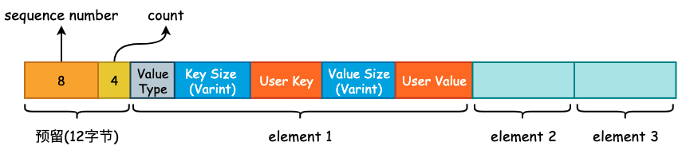
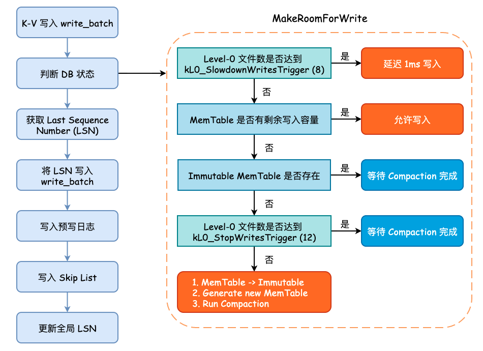

# leveldb 的写入流程

在前面一节中我们讨论了 leveldb 中的 varint 以及 Key 格式，用户所传入的 User Key 将会被封装成 MemTable Key，再加上 User Value 封装成 MemTable Entry 写入到 MemTable 中:


在这一节中，就来分析一下 K-V 是如何被写入到硬盘中的。

## 1. WriteBatch

`include/leveldb/db.h` 中的 `DB` 类提供了 leveldb 对外的抽象 API，该类中所有的函数均为纯虚函数，也就是说，`DB` 类其实就是一个 Interface。不过，由于 C++ 语法的特殊性，`DB` 类也可以对纯虚函数进行实现，并且 leveldb 也给出了默认实现。

有两个类实现了 `DB` 接口，一个是位于 `db/db_test.cc` 文件中的 `ModelDB`，另一个则是位于 `db/db_impl.cc` 中的 `DBImpl`。很明显，`ModelDB` 主要用于测试，而 `DBImpl` 才是 leveldb 实现的核心类。在本节中，我们只需要关注 `DBImpl::Put()` 和 `DBImpl::Write()` 这两个方法即可。

首先来看 `Put()` 方法:

```cpp
struct WriteOptions {
    WriteOptions() = default;
    bool sync = false;      /* 写入 WAL 时是否同步调用 fsync() */
};

/* DBImpl 实现的 Put() 方法，本质上还是调用了 leveldb 的默认实现 */
Status DBImpl::Put(const WriteOptions& o, const Slice& key, const Slice& val) {
  return DB::Put(o, key, val);
}

/* 真正的 Put() 方法实现 */
Status DB::Put(const WriteOptions& opt, const Slice& key, const Slice& value) {
  WriteBatch batch;
  batch.Put(key, value);
  return Write(opt, &batch);
}
```

`WriteOptions` 中只有 `sync` 一个字段，用于控制当 leveldb 将数据写入到预写日志时，是否同步地调用 `fsync()` 将内核缓冲区中的数据 flush 到硬盘，其值默认为 `false`。在生产实践中，这个值一般为 `true`，尽管为 `false` 时能够提高 leveldb 的写入速度，但是会有数据丢失的风险。

在 `DB::Put()` 方法中，生成了一个 `WriteBatch` 对象。leveldb 为了提高写入效率，会将多个线程提交的 K-V 写操作打包成一个 `WriteBatch` 对象，然后进行一次性写入，是一种常见的批量写入优化手段。`WriteBatch` 的底层数据结构实际上就是一个 `std::string`，用于承载多个 K-V。

```cpp
class WriteBatch {
public:
    WriteBatch();
    
    void Put(const Slice& key, const Slice& value); /* 添加 K-V */
    void Delete(const Slice& key);                  /* 删除 K-V */
    void Append(const WriteBatch& source);          /* Copy WriteBatch */
    
    /* Iterate 方法将会遍历 rep_ 中的 K-V，并根据 K-V 中的 Value Type 来决定
     * 调用 handler->Put() 或 handler->Delete()，Handler 是一个抽象基类*/
    Status Iterate(Handler* handler) const;         
private:
    friend class WriteBatchInternal;
    std::string rep_;
};
```

因为 `DB::Put()` 调用了 `WriteBatch::Put()` 方法，所以现在来看下 `WriteBatch::Put()` 方法的具体实现:

```cpp
/* 将 value.size() 进行 varint 编码，写入 dst 中，并且将 value 也追加到 dst 中 */
void PutLengthPrefixedSlice(std::string* dst, const Slice& value) {
  PutVarint32(dst, value.size());
  dst->append(value.data(), value.size());
}

/* 将 User Key、User Value 以及 Value Type 追加到 rep_ 中 */
void WriteBatch::Put(const Slice& key, const Slice& value) {
  WriteBatchInternal::SetCount(this, WriteBatchInternal::Count(this) + 1);
  rep_.push_back(static_cast<char>(kTypeValue));
  PutLengthPrefixedSlice(&rep_, key);
  PutLengthPrefixedSlice(&rep_, value);
}
```

可以看到，`WriteBatch::Put` 只是简单地将 User Key、User Value 以及 Value Type 进行打包，得到一个打包后的“数组”，其内存布局如下图所示:



需要注意的是在 `rep_` 的起始位置存在 12 字节的预留位，用于填充这些 K-V 的起始 Sequence Number 以及 Count 计数。将多个 K-V 打包完成以后，将会调用 `DBImpl::Write()` 方法，正式进入 leveldb 的写入流程。

## 2. 写入逻辑

在将数据写入预写日志文件之前，需要循环确认 leveldb 的状态，主要包括 MemTable 是否达到最大容量、Level-0 中的文件数是否已经达到某个阈值等。如果 MemTable 已经达到了最大容量，并且此时 Immutable MemTable 仍未 flush 到硬盘时，leveldb 将会等待后台线程完成其相关工作。这些判断均在 `MakeRoomForWrite()` 方法中进行:

1. 如果当前 Level-0 层的 SSTable 数量已经达到了阈值 `kL0_SlowdownWritesTrigger`（默认为 8），则会调用 `std::this_thread::sleep_for()` 方法延迟 1 毫秒写入，该延迟写入只会进行 1 次。
2. 如果当前 MemTable 容量没有达到最大大小（`write_buffer_size`，默认为 4MB）则允许写入，返回 OK 状态的 `Status`。
3. 如果 MemTable 已达到最大容量，并且 Immutable MemTable 仍存在的话，就需要等待 Compaction 完成。
4. 如果 Level-0 层的 SSTable 数量已经达到了阈值 `kL0_StopWritesTrigger`（默认为 12），同样需要等待 Compaction 完成。
5. 最后，当 MemTable 以达到最大容量，并且 Immutable MemTable 不存在时，就需要将 Memtable 主动地变更为 Immutable MemTable，并初始化一个新的 MemTable 和日志文件，并主动地触发 Minor Compaction，可能会创建一个新的线程执行，同时允许写入。

当 `MakeRoomForWrite()` 方法调用返回时，不管之前发生了什么，现在的 MemTable 一定是有剩余容量并且 Level-0 的文件数量大概率小于 4，所以可以进行接下来的写入流程。

而后，我们需要获取最新的 Sequence Number，并将 `last_sequence + 1` 写入到 `write_batch` 的起始位置上，而后就可以写预写日志了。

在写完预写日志以后，会根据 `options.sync` 的值来决定是否调用 `fsync()` 进行刷盘，成功以后就会将 `write_batch` 中数据写入至 Skip List 所实现的 MemTable 中。

这个过程在 `WriteBatch::Iterate()` 方法中进行，遍历 `rep_` 中打包好的 K-V，逐一地调用 `MemTable::Add()` 方法:

```cpp
void MemTable::Add(SequenceNumber s, ValueType type, const Slice& key,
                   const Slice& value);
```

可以看到，MemTable Entry 所需要的“四元素”均会由外部传入，在 `MemTable::Add()` 方法内部将会调用相关的编码函数将其打包成 MemTable Entry 的格式插入到 Skip List 中。MemTable Entry 格式具体可见本篇文章开头部分。

最后，leveldb 将会更新全局的 Sequence Number，其值就是原来的 Sequence Number 再加上此次 `write_batch` 写入的 K-V 数量。

整个写入流程可见下图:



关于预写日志的格式与写入流程将在下篇描述。
