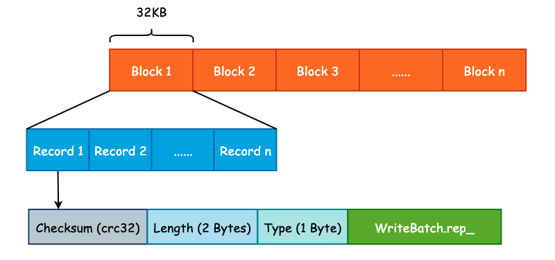
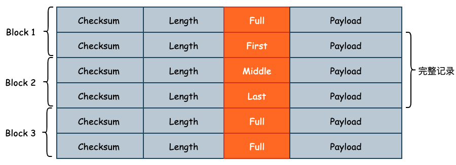
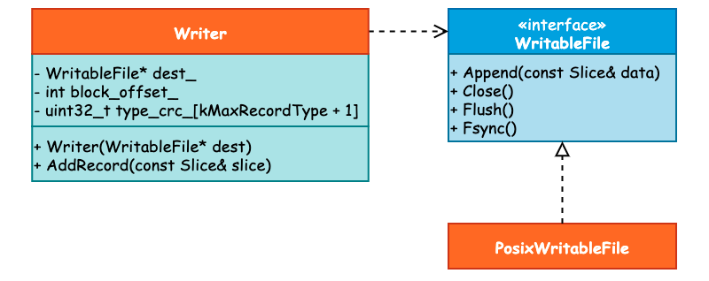

## leveldb 预写日志格式及其读写流程

对于存储引擎来说，为了能够加快写入速度，通常会将数据写入至位于内存的缓冲区中，然后由后台线程或者是其它方式再持久化至底层硬盘中。但是这样一来会有数据丢失的风险，因为内存中的数据是易失的。因此绝大多数存储引擎都是采用 WAL (Write Ahead Log) 的方式，首先将数据顺序地写入预写日志文件中，再去处理核心写入逻辑，以防止数据在节点宕机时的丢失。

InnoDB 存储的 redo log 就是一种典型的 WAL 实现，由于预写日志不可能任其无限增长，所以 InnoDB 使用了“环形数组”的方式进行覆盖写入，单个 redo log 的默认大小为 48MB。leveldb 并没有采用循环写入的方式实现，而是使用创建新的日志文件并删除旧有的日志文件实现。

leveldb 为了优化读取性能，将预写日志文件切割成了大小为 32KB 的连续 Block，并且每一个预写日志的大小为 4MB，和 MemTable 的默认大小保持一致。每一个 Block 中会包含多个连续的日志记录，每一个日志记录除了 User Key 和 User Value 以外，还会包括校验和（checksum）、长度以及记录类型等信息。预写日志格式如下图所示:




Log Type 是一个比较特殊的字段，是一个枚举值，定义如下:

```cpp
enum RecordType {
  kZeroType = 0,        /* 预留给预分配文件 */
  kFullType = 1,        /* 当前 Record 包含完整的日志记录 */
  kFirstType = 2,       /* 当前 Record 包含日志记录的起始部分 */
  kMiddleType = 3,      /* 当前 Record 包含日志记录的中间部分 */
  kLastType = 4         /* 当前 Record 包含日志记录的结束部分 */
};
```

设计 Log Type 的原因在于 User Key 和 User Value 的大小可能会超过 32KB，此时 Record 就需要跨 Block 存储。此时 leveldb 就会将该条日志记录切分成多条 Log Record，Log Type 就是用来记录当前 Record 属于切分后 Record 的哪一个部分的，如下图所示:



### 1. 预写日志写入流程

我们如何写入一个数据决定了如何读取一个数据，因此不管是在设计业务应用还是在设计系统应用时，可以先从写入方式入手。

与预写日志相关的类主要包括 3 个: `WritableFile`、`Writer` 以及 `PosixWritableFile`。其中 `WritableFile` 看名字就可以知道是一个 Interface，并且 `PosixWritableFile` 实现了该接口。而 `Writer` 则依赖于 `WritableFile`，它们之间的关系可见下图:



当我们调用 `DBImpl::Write()` 写入 Batch 数据时，在确认 DB 的写入状态以后将会首先调用 `Writer::AddRecord()` 方法写入预写日志，接下来就来看具体的写入过程。

首先，leveldb 取出 `slice` 里面的指针数据和长度，这个 `slice` 其实就是 `WriteBatch.rep_`，具体格式可见上一篇分析。而后，初始化 `begin` 标志位为 `true`，用于表示这是一条日志的起始位置。在写入过程中还会有一个 `end` 标志位，表示是否为日志的结束位置，那么根据 `begin` 和 `end` 这两个标志位我们就可以决定 `RecordType` 了。比如当 `begin` 和 `end` 都为 `true` 时，那么 `RecordType` 应为 `Full`。

```cpp
const char* ptr = slice.data();     /* 获取 WriteBatch 底层数据 */ 
size_t left = slice.size();         /* 剩余写入数据长度 */
Status s;               
bool begin = true;                  /* 标志位 */
```

紧接着，当剩余写入长度，也就是 `left` 大于 0 并且写入过程没有出错的话，就会循环写入数据。在循环写入时，由于一个 Block 的容量为 32KB，因此需要确定还有多少空间可以写入。如果说剩余的空间小于 `kHeaderSize`，也就是 Record Header（7 字节）的大小时，那么就需要开辟新的 Block 写入: **Record Header 不能跨 Block 写入**。

```cpp
/* 计算当前 Block 剩余写入 */
const int leftover = kBlockSize - block_offset_;
assert(leftover >= 0);
/* 如果当前 Block 不足以写入 Record Header 的话，需要使用新的 Block */
if (leftover < kHeaderSize) {
    // Switch to a new block
    if (leftover > 0) {
        // Fill the trailer (literal below relies on kHeaderSize being 7)
        /* 如果还有剩余空间的话，用 0 进行补齐 */
        static_assert(kHeaderSize == 7, "");
        dest_->Append(Slice("\x00\x00\x00\x00\x00\x00", leftover));
    }
    /* Block 写入偏移量清零，向新的 Block 中写入 */
    block_offset_ = 0;
}
```

在确定了 `block_offset_` 以后，就需要做另一个非常重要的工作: 确定 `RecordType`。也就是使用 `begin` 和 `end` 这两个标志位来完成:

```cpp
/* 计算剩余写入容量 */
const size_t avail = kBlockSize - block_offset_ - kHeaderSize;
/* 计算片段长度 */
const size_t fragment_length = (left < avail) ? left : avail;

RecordType type;
const bool end = (left == fragment_length);
if (begin && end) {   /* 刚好装下 */
    type = kFullType;
} else if (begin) {   /* 一个 Block 无法装下 */
    type = kFirstType;
} else if (end) {     /* 能装下上一份数据 */
    type = kLastType;
} else {              /* 其它的中间状态 */
    type = kMiddleType;
}
```

最后，调用 `EmitPhysicalRecord()` 方法，这是预写日志真正被写入的地方，并更新数据指针、剩余长度以及 `begin` 标志位:

```cpp
s = EmitPhysicalRecord(type, ptr, fragment_length);
ptr += fragment_length;
left -= fragment_length;
begin = false;
```

在 `EmitPhysicalRecord()` 方法中，会计算数据的 CRC32、数据长度等信息，并调用 `WritableFile` 接口的 `Append()` 和 `Flush()` 方法将数据写入至内核缓冲区中，而是否进行 `fsync()` 取决于用户的配置，也就是 `Options.sync` 字段。

### 2. 预写日志读取流程

在写入预写日志时 leveldb 简单地使用 Block + Record 的方式进行写入，读取过程除了最基本的读取文件内容以外，还需要校验 CRC32、根据 `RecordType` 决定读取策略。因此，日志读取的过程要比写入过程更加复杂。

TODO: 该部分内容暂时缺省。


### 3. 预写日志的清理

预写日志的大小不可能无限制地增长，因此，要么采用后台线程定时清理，要么将清理逻辑分散在其它业务逻辑中，当触发了某一个条件时对其进行清理。leveldb 采用了后者的实现方式，即将预写日志的删除放在了关键节点中，由系统运行时进行触发。

预写日志的清理由 `RemoveObsoleteFiles()` 方法进行，并且主要发生在两个部分，一个是在调用 `Open()` 方法打开 DB 时，leveldb 将会清理不再需要的文件，其中就包括了预写日志文件。另一个则是发生在 Compaction 时。

当完成 Minor Compaction 之后，Immutable Mmetable 已经被持久化至硬盘中，那么此前的一些预写日志就可以被删除了，因为这部分数据不会在宕机时丢失。而在进行 Major Compaction 时，将会由后台线程完成 Compaction 的动作，因此可以借着这一异步任务来完成预写日志的清理，不必再开辟新的线程。

最后需要注意的是，WAL 需要保留上一个预写日志，以防止意外发生。