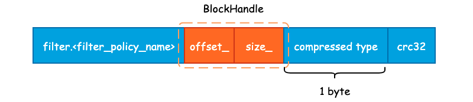
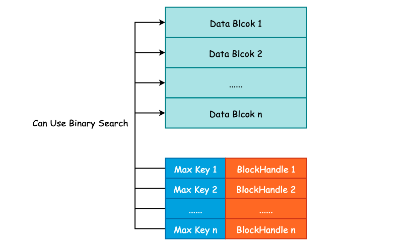
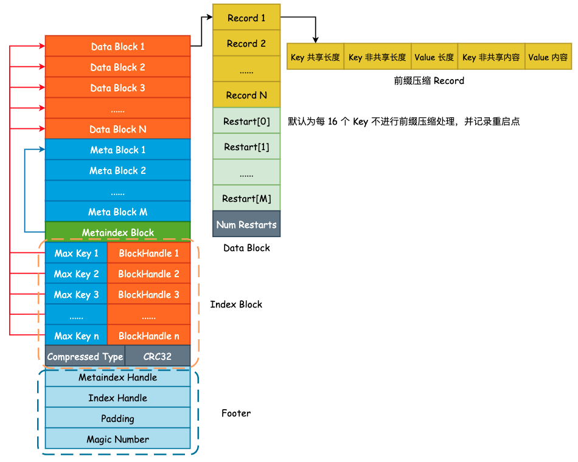

# SSTable 之索引

在前面我们已经将 Data Block 和 Filter Block 的格式和内容梳理完毕了，由于 Data Block 和 Filter Block 在文件中是连续存储的，并且大小不固定，所以需要为其建立索引，也就是 Metaindex Block 和 Index Block。

## 1. Metaindex Block

Metaindex Block 用于存储 Filter Block 在整个 SSTable 中的索引信息，并且只有一行记录，只需要记录下所使用的 Filter Policy 名称，以及 `BlockHandle` 信息。首先来看下 `BlockHandle` 对象:

```cpp
class BlockHandle {
public:
    /* BlockHandle 的最大长度，即 20 字节 */
    enum { kMaxEncodedLength = 10 + 10 };
private:
    uint64_t offset_;   /* 偏移量 */
    uint64_t size_;     /* 数据大小 */
};
```

也就是说，对于 Filter Block 而言，只需要记录下 Filter Block 的起始地址和大小即可，下面为 Metaindex Block 的完整记录信息:



Metaindex Block 的起始位置为 "filter." 和过滤器名字所组成的一个常量字符串，如果使用默认的 `BloomFilterPolicy` 的话，那么这个值就为 "filter.leveldb.BuiltinBloomFilter2"。

紧接着就是 `BlockHandle` 的内容，这部分的内容起始就是 Filter Block 在 SSTable 的起始偏移量和 Filter Block 的大小，使用 varint64 变长编码的方式写入至结果字符串中。

最后，就是 Block 的统一格式后缀了。包括 1 字节的压缩类型，默认为 snappy 压缩，以及 4 字节的 CRC32 校验和。

## 2. Index Block

Index Block 的作用除了记录下每个 Data Blcok 的起始位置和大小以外，还会额外记录每一个 Data Block 的最大 Key 值，由 `FindShortestSeparator()` 方法计算得出，我们将在下一节中详细解释这个最大 Key 值是如何计算得到的。

记录下每一个 Data Block 的最大 Key 值主要目的就是为了方便二分搜索算法的执行，降低查询 SSTable 的时间复杂度，Index Block 的格式如下图所示:



这种记录下每一个 Data Block 的最大 Key 值其实和 InnoDB Page Directory 非常之类似，通过记录一些额外的信息来优化搜索。关于 Page Diectory 更详细的信息，可参考另一个项目 Psyduck: [InnoDB 数据页结构](https://smartkeyerror.oss-cn-shenzhen.aliyuncs.com/Phyduck/database/InnoDB-Page.pdf)。

紧接着就是常规的 `BlockHandle` 内容以及 Compressed Type 和 CRC32 了。

## 3. Footer

最后我们再来看下 Footer。Footer 大小固定，为常量值 48 字节。Data Block 中的每一个 Block 由 Index Block 进行索引，Filter Block 的起始地址由 Metaindex Block 进行索引。由于 Index Block 和 Metaindex Block 的大小同样不固定，所以我们还需要对 Index Block 和 Metaindex Block 进行索引，并且这个索引的大小和所处文件位置必须是固定的，否则我们就缺少了一个入口点。

```cpp
class Footer {
public:
      /* 固定大小，48 字节，不足 48 字节时将使用 padding 填充 */
      enum { kEncodedLength = 2 * BlockHandle::kMaxEncodedLength + 8 };
private:
      BlockHandle metaindex_handle_;    /* 索引 Metaindex Block */
      BlockHandle index_handle_;        /* 索引 Index Block */
};
```

除了这两个索引以外，leveldb 还会在 SSTable 的结尾处写入一个名为 kTableMagicNumber 的“魔数”，具体作用笔者也还没有整明白，其内容为 "http://code.google.com/p/leveldb/" 使用 sha1 哈希之后的前 8 个字节。Footer 的整体布局如下图所示:


## 4. 小结

本篇文章其实是对 SSTable 的进一步补充，以便更容易理解 `TableBuilder` 的建表过程，下面给出一个更完整详细的 SSTable 示意图:


