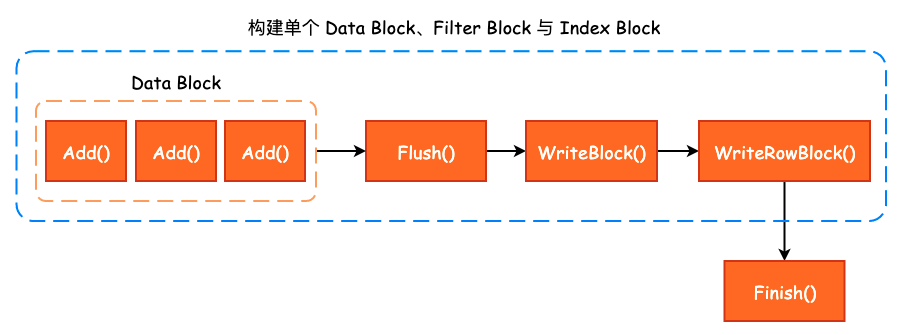
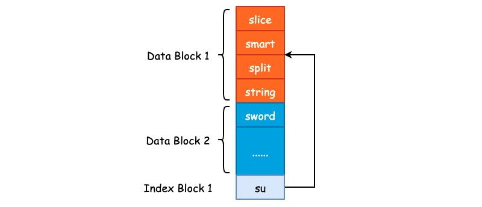

# SSTable—Table Builder

在前面我们已经完成了 Data Block、Filter Block 以及 Metaindex Block、Index Block 的构建过程梳理，那么最后需要做的事情就是将这些构建过程串联起来，得到一个完成的 SSTable。

## 1. Table Builder

和 `BlockBuilder`、`FilterBlockBuilder` 的命名方式一样，构建 SSTable 的类名称叫做 `TableBuilder`，其内部将 `BlockBuilder`、`FilterBlockBuilder` 等内容组合起来，以构建 SSTable。

```cpp
class LEVELDB_EXPORT TableBuilder {
public:
    /* WritableFile 通常为 PosixWritableFile */
    TableBuilder(const Options& options, WritableFile* file);
    
    /* 向 TableBuilder 中添加 Key-Value，这里的 Key 同样为 InternalKey */
    void Add(const Slice& key, const Slice& value);
    
    /* 将缓冲区中的数据 flush 到文件中，由 leveldb 内部调用 */
    void Flush();
    
    Status status() const;
    
    /* 结束 Table 的构建 */
    Status Finish();
    
    /* 放弃 Table 的构建 */
    void Abandon();
    
    /* 一共添加了多少 Key-Value 对 */
    uint64_t NumEntries() const;

private:
    bool ok() const { return status().ok(); }
    /* 序列化需要写入的 Data Block */
    void WriteBlock(BlockBuilder* block, BlockHandle* handle);
    /* 将压缩后的数据写入文件中 */
    void WriteRawBlock(const Slice& data, CompressionType, BlockHandle* handle);
    
    /* Rep 的作用就是隐藏具体实现 */
    struct Rep;
    Rep* rep_;
};
```

`TableBuilder` 对外提供的接口非常简洁，主要就是 `Add()`、`Flush()` 以及 `Finish` 这三个方法的调用，并且从名称上来看我们也能够大致地猜测出方法的功能。 在 `TableBuilder` 中只有唯一的一个成员变量 `rep_`，其类型为 `Rep *`。`Rep_` 这个结构体的作用就是做了另一层的封装，能够让 `TableBuilder` 这个类更清爽一些:

```cpp
struct TableBuilder::Rep {
  
    Options options;              /* Data Block Options */
    Options index_block_options;  /* Index Block Options */
    WritableFile* file;           /* 抽象类，决定了如何进行文件的写入，PosixWritableFile */
    uint64_t offset;              /* Data Block 在 SSTable 中的文件偏移量 */
    Status status;                /* 操作状态 */
    BlockBuilder data_block;      /* 构建 Data Block 所需的 BlockBuilder */
    BlockBuilder index_block;     /* 构建 Index Block 所需的 BlockBuilder */
    std::string last_key;         /* 当前 Data Block 的最后一个写入 key */
    int64_t num_entries;          /* 当前 Data Block 的写入数量 */
    bool closed;                  /* 构建过程是否结束 */
    FilterBlockBuilder* filter_block; /* 构建 Filter Block 所需的 BlockBuilder */
    
    bool pending_index_entry;     /* pending_index_entry 用于 Add() 方法中 */
    BlockHandle pending_handle;  // Handle to add to index block
    
    std::string compressed_output;  /* 压缩之后的 Data Block */
};
```

`TableBuilder` 中各个方法的调用关系如下图所示:




## 2. `TableBuilder::Add()`

在实际地向 Data Block 和 Filter Block 添加数据之前，需要进行基本的逻辑判断，比如说当前 Build 过程是否结束，也就是是否已经调用了 `Finish()` 或者是 `Abandon()` 方法。另一点就是需要保证当前添加的 Key 一定是大于 `last_key` 的，保证 Data Block 的有序性:

```cpp
void TableBuilder::Add(const Slice& key, const Slice& value) {
    Rep* r = rep_;
    assert(!r->closed);     /* 判断当前 Build 过程是否结束 */
    if (!ok()) return;
    if (r->num_entries > 0) {
        /* 判断当前 key 是否大于 last_key */
        assert(r->options.comparator->Compare(key, Slice(r->last_key)) > 0);
    }
}
```

紧接着，就是对 `pending_index_entry` 进行判断。`pending_index_entry` 是一个布尔型的标志位，用于表示是否到了生成 Index Block 的时机，如果 `pending_index_entry` 为 `true` 的话，那么就去生成 Index Block，否则继续构建 Data Block 和 Filter Block。那么 `pending_index_entry` 什么时候为 `true` 呢？答案就是在写完一个 Data Block 之后:

```cpp
/* Data Block 的默认大小为 4KB */
if (estimated_block_size >= r->options.block_size) {
    /* Flush() 方法内部将会把 pending_index_entry 置为 True */
    Flush();
}
```

**也就是说，当 `Add()` 方法在写入下一个 Data Block 的第一个 Key-Value 对时，才会为上一个 Data Block 构建 Index Block**，这一点作者在原注释中已经解释了。其根本目的就是使用更短的 Key 来作为 Index Block 的 Key。比如说上一个 Data Block 的数据为 `["smart", "split", "slice", "string"]`，排序后得到 `['slice', 'smart', 'split', 'string']`。因此，"string" 就是上一个 Data Block 的结束边界，如果说当前 Data Block 的起始边界为 "sword" 的话，**那么就可以使用 "su" 来作为上一个 Data Block 的 Index Block Key**。因为 "su" 大于 "string"，并且小于 "sword"。这么做并不会影响搜索，同时节省了磁盘存储空间，一个非常巧妙的设计。

```cpp
/* 在构建下一个 Data Block 之前，将 Index Block 构建出来 */
if (r->pending_index_entry) {
    /* 当前 Data Block 必然为空 */
    assert(r->data_block.empty());
    
    /* 通过 last_key 和 当前 key 计算得到一个 X，使得 last_entry <= X < key  */
    r->options.comparator->FindShortestSeparator(&r->last_key, key);
    std::string handle_encoding;
    r->pending_handle.EncodeTo(&handle_encoding);
    
    /* 向 Index Block 中添加上一个 Data Block 的 Index */
    r->index_block.Add(r->last_key, Slice(handle_encoding));
    
    /* 上一个 Data Block 的 Index Block 已经写完，故更新 pending_index_entry 为 false */
    r->pending_index_entry = false;
}
```



我们可以在 `InternalKeyComparator::FindShortestSeparator()` 这个方法中去检验当我们传入不同的 `last_key` 和 `key` 得到的 Index Block Key 是否是满足基本要求的。

不管是否需要写入 Index Block，Data Block 和 Filter Block 都是需要写入的，那么 `Add()` 方法下面的流程就是调用 `FilterBlockBuilder` 和 `BlockBuilder` 的相关方法写入 Internal Key 和 User Value:

```cpp
/* 若指定了 FilterPolicy，那么就会写入 Filter Block */
if (r->filter_block != nullptr) {
    r->filter_block->AddKey(key);
}

/* 更新 last_key */
r->last_key.assign(key.data(), key.size());
/* 更新 Key-Value 写入数量 */
r->num_entries++;
/* 将数据添加至 Data Block 中 */
r->data_block.Add(key, value);
```

最后，如果当前 Data Block 的预估大小（未进行压缩之前的大小）超过了 `Options.block_size` 阈值的话，那么就会调用 `Flush()` 方法结束当前 Block 的构建:

```cpp
/* Data Block 的默认大小为 4KB */
const size_t estimated_block_size = r->data_block.CurrentSizeEstimate(); 
if (estimated_block_size >= r->options.block_size) {
    /* 结束当前 Block 的构建，Flush() 方法内部将会把 pending_index_entry 置为 True */
    Flush();
}
```

## 3. `TableBuilder::Flush()`

`Flush()` 方法结束当前 Data Block 的构建，其调用时机我们在 `Add()` 方法中已经分析过了，即当 Data Block 的预估大小超过了 `Options.block_size` 时，将会调用 `Fulsh()` 方法。在该方法内部，将会对 Data Block 进行压缩，leveldb 默认使用 snappy 压缩方法，同样是 Google 的开源项目: [snappy](https://github.com/google/snappy):

```cpp
void TableBuilder::Flush() {
    Rep* r = rep_;
    assert(!r->closed);
    if (!ok()) return;
    if (r->data_block.empty()) return;
    assert(!r->pending_index_entry);
    
    /* 对 Data Block 进行压缩，并生成 Block Handle */
    WriteBlock(&r->data_block, &r->pending_handle);
    if (ok()) {
        /* 设置 pending_index_entry 为 true，下一次写入 Data Block 时，需构建 Index Block */
        r->pending_index_entry = true;
        /* 将数据写入至内核缓冲区 */
        r->status = r->file->Flush();
    }
    if (r->filter_block != nullptr) {
        /* 创建一个新的 Filter Block */
        r->filter_block->StartBlock(r->offset);
    }
}
```

`Flush()` 方法本身比较简单，最为核心的调用为 `WriteBlock()`，这也是 `TableBuilder` 的私有方法之一，和 `WriteRawBlock()` 搭配使用。

## 4. `TableBuilder::WriteBlock()` 与 `TableBuilder::WriteRawBlock()`

在 `WriteBlock()` 方法中，主要对 Data Block 进行 snappy 压缩，同时，如果压缩率低于 12.5% 的话，将不会使用 snappy 压缩，直接存储原数据:

```cpp
void TableBuilder::WriteBlock(BlockBuilder* block, BlockHandle* handle) {
    Rep* r = rep_;
    /* 获取 Data Block 的全部数据 */
    Slice raw = block->Finish();
    Slice block_contents;
    
    /* 默认压缩方式为 kSnappyCompression */
    CompressionType type = r->options.compression;
    
    switch (type) {
        case kNoCompression:
              block_contents = raw;
              break;

        case kSnappyCompression: {
            std::string* compressed = &r->compressed_output;

            /* 进行 snappy 压缩，并且只有在压缩率大于 12.5 时才会选用压缩结果 */
            if (port::Snappy_Compress(raw.data(), raw.size(), compressed) &&
                compressed->size() < raw.size() - (raw.size() / 8u)) {
                    block_contents = *compressed;
            } else {
                /* 未配置压缩算法，或者是使用 snappy 压缩时压缩率低于 12.5% */
                block_contents = raw;
                type = kNoCompression;
            }
            break;
        }
    }
    /* 将处理后的 block contents、压缩类型以及 block handle 写入到文件中 */
    WriteRawBlock(block_contents, type, handle);
    /* 清空临时存储 buffer */
    r->compressed_output.clear();
    /* 清空 Data Block */
    block->Reset();
}
```

## 5. `TableBuilder::Finish()`

最后再来看 `Finish()` 方法，该方法表示已经将所有的 Key-Value 添加至 SSTable 中，并进行一些收尾工作，例如写入 Metaindex Block，Footer 等。整个 `Finish()` 方法的逻辑非常清晰，大体上可以分为 5 个部分:

首先调用 `TableBuilder::Flush()` 方法将最后一个 Data Block 写入，由于最后一个 Data Block 可能只有少数几个 Key-Value，无法自行触发 `Flush()` 方法的调用，因此需要主动地再次调用:

```cpp
Rep* r = rep_;
/* 将最后一个 Data Block 写入 */
Flush();
assert(!r->closed);
/* 更新关闭标志位为 true */
r->closed = true;
```

紧接着，将 Filter Block 写入:

```cpp
// Write filter block
  if (ok() && r->filter_block != nullptr) {
    WriteRawBlock(r->filter_block->Finish(), kNoCompression,
                  &filter_block_handle);
  }
```

然后，写入 Metaindex Block，并添加 "filter.leveldb.BuiltinBloomFilter2" 到 Metaindex Block 中，以快速定位 Filter Data:

```cpp
if (ok()) {
    BlockBuilder meta_index_block(&r->options);
    if (r->filter_block != nullptr) {
        std::string key = "filter.";
        /* 若使用 Bloom Filter，key 的值为 filter.leveldb.BuiltinBloomFilter2 */
        key.append(r->options.filter_policy->Name());
        std::string handle_encoding;
        filter_block_handle.EncodeTo(&handle_encoding);
        meta_index_block.Add(key, handle_encoding);
    }

    /* 写入 Metaindex Block */
    WriteBlock(&meta_index_block, &metaindex_block_handle);
}
```

最后，将 Index Block 和 Footer 写入即可，整个 SSTable 的构建过程也就结束了。