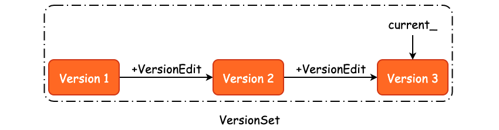
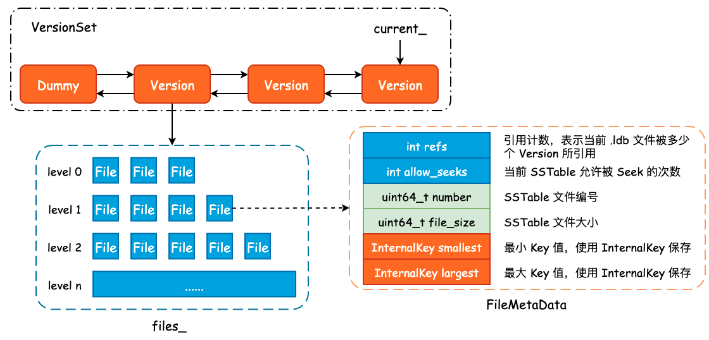

# leveldb 版本控制概览

在上一篇文章中我们明确了 Minor Compaction 的过程，本质上就是根据 Immutable MemTable 构建出 New SSTable，然后根据 New SSTable 和其它低层 level 之间 User Key 的重叠情况，决定将 New SSTable 逻辑地“推送”至具体的一个 level 中。

按照流程执行的顺序，这一篇文章应该描述 Major Compaction，但是由于 leveldb 的版本控制不管是在 Major Compaction 还是 Seek Compaction 中都起到了非常决定性的作用。同时在代码中也大量涉及到了 Version、VersionSet 等内容，因此我们需要首先对 leveldb 的版本控制有一个大局上的概览，才能够更好地理解 Major Compaction 和 Seek Compaction。

## 1. 为什么需要版本控制

我们现在已经知道了 leveldb 采用的是“追加写”的方式完成 K-V 的新增、修改和删除的，并且 leveldb 将磁盘中的 SSTable 采用逻辑分区的方式进行了分层处理，那么 level 和 level 所包含的 SSTable 信息就需要保存下来，以便于后续的查找和 Compaction 操作。同时，leveldb 还需要持久化元数据，例如 WAL Log Numer、Sequence Number 以及 Next SSTable File Number 等信息，保证 leveldb 在异常 Crash 之后能够完全地恢复至宕机之前的状态。

leveldb 是通过版本控制的方式来记录上述关键信息的，其过程和 Git 工作流程非常之类似:

- 初始化一个 Empty Repo（DB 初始化）;
- 对文件进行新增、修改和删除时，Git 会记录下这一增量的操作（新增一个 VersionEdit）;
- 根据最初的版本和增量的 commit，可以得到现有版本（Version）;
- 根据最初的版本和所有的 commit 可以得到所有的版本（VersionSet）;
- 使用 HEAD 指针指向最新的版本（CURRENT）；

每当我们新增或者是删除一个 SSTable 时，都是一个增量操作，leveldb 使用 VersionEdit 进行记录，也就是说，我们可以根据某一个版本的 Version 以及 VersionEdit 来推测得到下一个版本:

```bash
Version N + VersionEdit => Version N+1
```

那么，当我们把所有的版本都扔到一个集合中，比如 Version 1、Version 2、...、Version N，就得到了所有版本的集合，也就是 VersionSet，如下图所示:



## 2. 记录 SSTable 元数据: `FileMetaData`

首先我们需要明确 `.ldb` 文件的元数据到底包括哪些内容，以及 leveldb 是使用什么方式记录的，答案就是 `FileMetaData`，其定义如下:

```cpp
/* 记录了一个 SSTable 的元信息 */
struct FileMetaData {
    FileMetaData() : refs(0), allowed_seeks(1 << 30), file_size(0) {}
    
    int refs;             /* 引用计数，表示当前 SSTable 被多少个 Version 所引用 */
    int allowed_seeks;    /* 当前 SSTable 允许被 Seek 的次数 */
    uint64_t number;      /* SSTable 文件记录编号 */
    uint64_t file_size;   /* SSTable 文件大小 */
    InternalKey smallest; /* 最小 Key 值 */
    InternalKey largest;  /* 最大 Key 值 */
};
```

除了 `.ldb` 文件的编号和大小以外，leveldb 还会额外地记录下当前 SSTable 中的最小 `InternalKey` 和最大 `InternalKey`，一方面用于数据查询，另一方面则用为 Compaction 提供帮助。

一个 `FileMetaData` 表示了一个 SSTable，那么如果我们使用两个数组来记录下每一个 level 的新增和删除的话，就得到了版本变更的一条 commit。事实上，leveldb 也是如此设计的:

```cpp
class VersionEdit {
public:
    /* 将 VersionEdit 序列化成 string，内部使用 varint */
    void EncodeTo(std::string* dst) const;
    Status DecodeFrom(const Slice& src);
private:
    /* 其中的 pair 为 level + 文件编号，表示被删除的 .ldb 文件 */
    typedef std::set<std::pair<int, uint64_t>> DeletedFileSet;
  
    std::string comparator_;        /* Comparator 名称 */
    uint64_t log_number_;           /* 日志编号 */
    uint64_t prev_log_number_;      /* 前一个日志编号 */
    uint64_t next_file_number_;     /* 下一个文件编号 */
    SequenceNumber last_sequence_;  /* 最大序列号 */
  
    DeletedFileSet deleted_files_;  /* 记录哪些文件被删除了 */
    
    /* 记录哪一层新增了哪些 .ldb 文件，并且使用 FileMetaData 来表示 */
    std::vector<std::pair<int, FileMetaData>> new_files_;
};
```

对于 SSTable 的删除，leveldb 只是简单地记录下被删除文件所在层数及其文件编号，以节省存储空间。而对于新增操作来说，我们就需要记录下新增文件的详细信息。这些数据在 Minor Compaction 中即完成，更具体地说，是在 `BuildTable()` 方法中完成的。

## 3. `Version` 与 `VersionSet`

前面我们已经描述了 SSTable 元数据 `FileMetaData` 和增量修改 `VersionEdit`，那么 `VersionEdit` + `FileMetaData` 就可以得到当前数据库的一个版本，也就是 `Version`。多个 `Version` 组合起来就得到了 `VersionSet`，`VersionSet` 本质上其实就是一个双向链表。

```cpp
class Version {
private:
    explicit Version(VersionSet* vset) {}
    
    /* 标准的双向链表实现 */
    Version* next_;
    Version* prev_;
    int refs_;
    
    /* 每一个 level 所包含的全部 .ldb 文件，由 FileMetaData 表示 */
    std::vector<FileMetaData*> files_[config::kNumLevels];
    
    /* Next file to compact based on seek stats.
     * 根据 Seek 的过程决定下一次选定的 Compaction 文件和目标 level */
    FileMetaData* file_to_compact_;
    int file_to_compact_level_;
    
    /* Size Compaction 相关 */
    double compaction_score_;
    int compaction_level_;
};
```

除开与双向链表相关的两个指针，以及与 Compaction 相关的字段以外，`Version` 中最为重要的字段就是 `files_` 了。该字段是一个静态数组，数组内的元素类型为 `std::vector`，因此 `files_` 中保存了每一层的每一个 SSTable 元数据，可以说是 leveldb 的一个“数据骨架快照”。

`VersionSet` 是一个由 `Version` 所组成的双向链表，并且其内部使用了一个虚拟头结点，即 `dummy_versions_`。

`FileMetaData`、`Version` 以及 `VersionSet` 之间的关联关系可以使用下图大致表示:



为了避免进程崩溃或机器宕机导致的数据丢失，leveldb 需要将这些版本信息持久化至磁盘中，也就是 Manifest 文件。Manifest 文件通常来说会有很多个，leveldb 在 CURRENT 文件中会保存最新的 Manifest 文件名称。

Manifest 的文件内容其实就是一个又一个的 `VersionEdit`，通过 `VersionEdit::EncodeTo()` 方法将 Object 序列化成 string，然后再写入至 Manifest 文件中。

到这里，其实已经足以让我们继续梳理 Major Compactiuon 了，因此关于版本控制的更多细节和设计巧思，就不在本文中详细展开了。